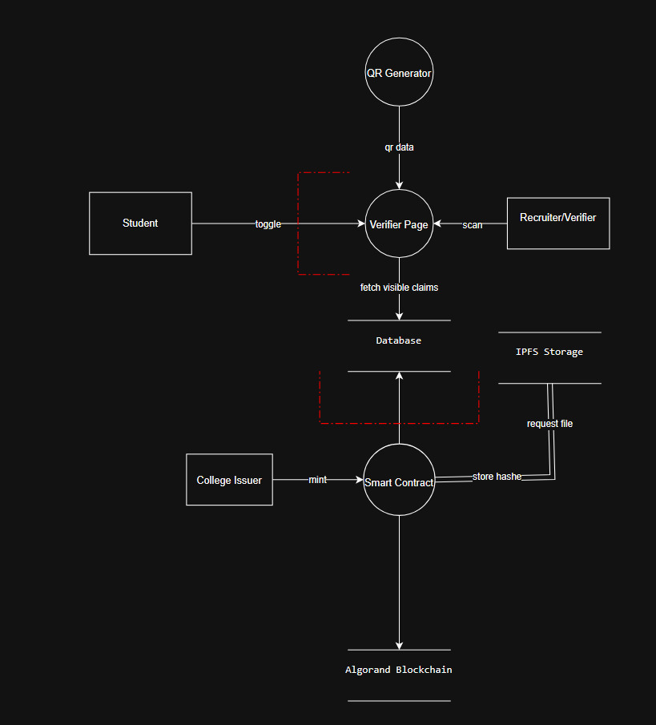
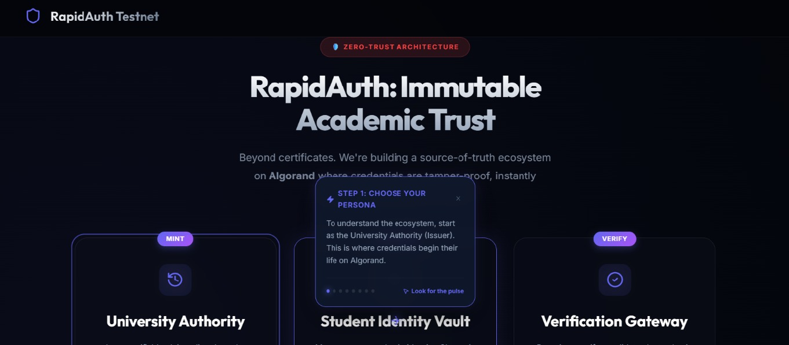
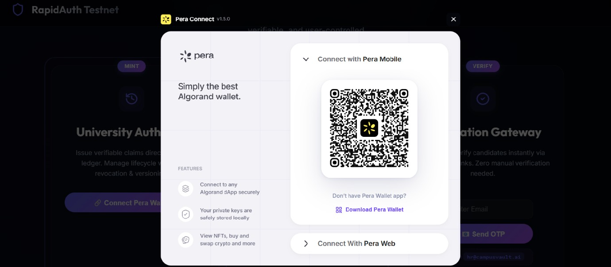
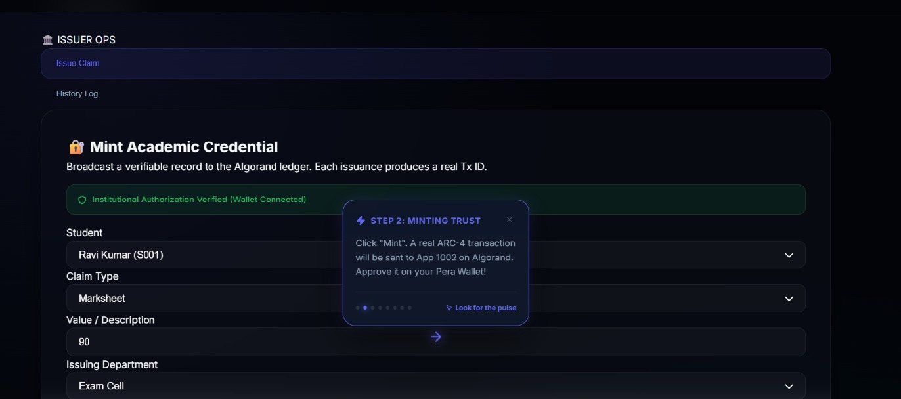
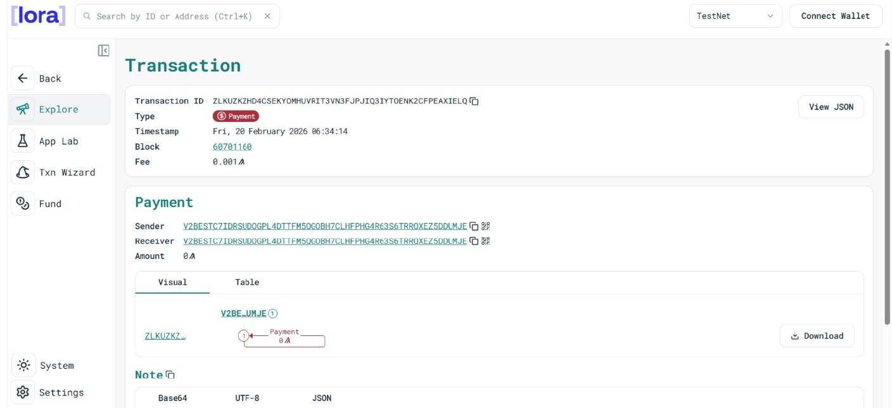
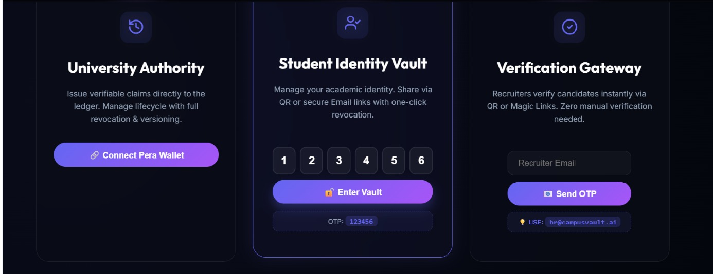
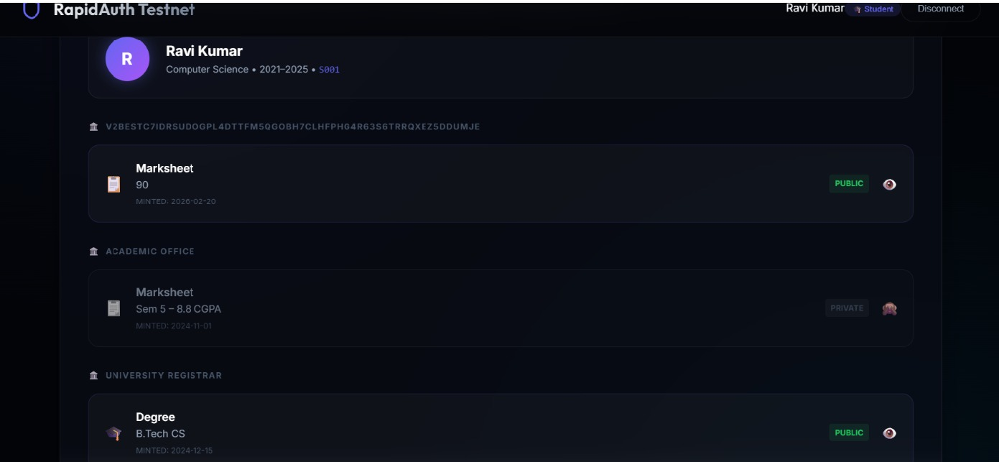
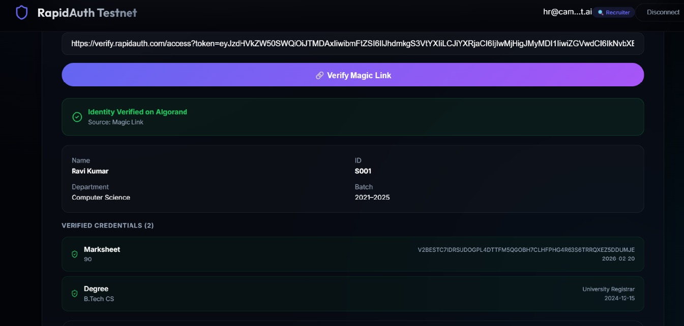
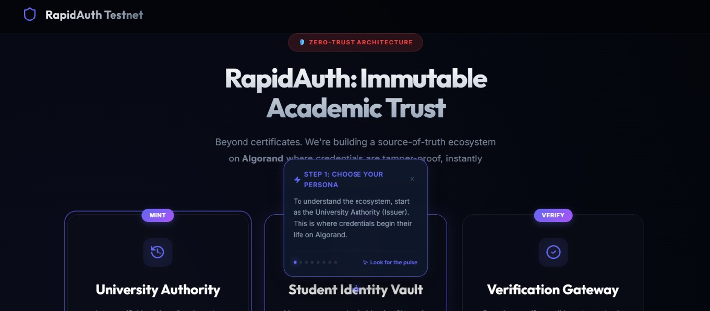

<h1 align="center">
  RapidAuth: End-to-End Document Integrity System for Academic Credentials
</h1>

# 📌 Project Description

RapidAuth is a blockchain-based credential verification platform that enables educational institutions to issue tamper-proof digital documents as verifiable claims on the Algorand blockchain.

The system creates a unified, transparent layer for the entire document lifecycle:
- Issuance  
- Student control  
- Verification  
- Revocation  
- Audit  

Across all college-issued credentials.

---

# 🚨 The Problem

Educational institutions face a credential crisis:

- Students wait days for simple documents like NOCs and bonafide certificates.
- Recruiters spend weeks verifying marksheets and internship proofs.
- 68% of recruiters admit they cannot verify every document thoroughly.
- Fake documents cost Indian companies an estimated ₹1,200 crore annually.
- College staff spend 40–50% of their time handling verification requests.

### ❌ Existing Solutions Fail

- DigiLocker excludes college-level issuance.
- Academic ERPs lack external verification capability.
- Most blockchain solutions focus only on degrees.
- NOCs, LORs, internships, and achievement certificates are ignored.

---

# 🌐 Live Demo URL
 
https://rapid-auth-two.vercel.app/

Deployed backend link: 

---

# 🎥 LinkedIn Demo Video URL

https://www.linkedin.com/posts/kirthi-jc-5390b8310_algorand-blockchain-hackathon-activity-7430438559108591616-o1fX?utm_source=share&utm_medium=member_desktop&rcm=ACoAAE8Jc_0BdkNohj9rAORVrI-zgYlOtl6x5DE

---

# 🔗 Smart Contract Details

**App ID (Testnet):** `755797878`  
**Testnet Explorer:**  https://lora.algokit.io/testnet/application/755797878

---

# 🏗 Architecture Overview

RapidAuth follows a hybrid Web3 architecture combining **Algorand blockchain**, **Firebase database**, and **IPFS storage** to achieve security, scalability, and usability.

---

# 🔗 Smart Contract (Algorand Testnet)

## 📜 Core Smart Contract Functions

### ✅ Issuer Whitelist
Only pre-approved wallet addresses can mint claims.  
Prevents unauthorized document creation.

### ✅ Claim Minting
Stores the following on-chain:
- Document hash
- Metadata
- Issuer address
- Timestamp
- Status
- Expiry
- Version links

Ensures tamper-proof academic credentials.

### ✅ Revoke System
- Updates on-chain status to **"revoked"**
- Mandatory reason code (e.g., fraudulent, error, disciplinary)
- Records timestamp + revoker address

Ensures transparent invalidation.

### ✅ Superseding
- Marks old documents as **"superseded"**
- Links to new version
- Preserves full version history

### ✅ Audit Events
- Emits ARC-4 events for every state change:
  - Issuance
  - Revocation
  - Superseding
- Creates immutable, transparent audit log

---

# 💻 Frontend (React + TypeScript)

### 🔄 Generated Client
AlgoKit generates a typed client from the ARC-56 ABI for type-safe contract calls.

### 👛 Wallet Integration
Pera Wallet Connect for issuers (whitelisted addresses only).

### 🔐 Authentication
Firebase Auth (Email + OTP) for students — no wallet required.

### 🗄 Storage
- Firebase Firestore → Student profiles & visibility settings
- IPFS (Pinata) → Document files

### 🔎 Indexer
Algorand Indexer for efficient claim retrieval without direct contract calls.

---

# ✨ Key Features Implemented

---

## 1️⃣ Zero-Friction Student Access (No Crypto Knowledge Required)

- Students log in with college email + OTP.
- No wallets or seed phrases required.
- Custodial wallets managed behind the scenes.
- Recruiters verify via magic email links (no Pera Wallet needed).

---

## 2️⃣ Complete Document Lifecycle with Visual Status Badges

Each document clearly displays:

- 🟢 **Active** – Currently valid  
- 🟡 **Expiring Soon** – Within 30 days  
- 🔴 **Expired** – Past expiry date  
- ❌ **Revoked** – Permanently invalidated (reason on hover)  
- 🔁 **Superseded** – Newer version exists (linked)

Provides instant clarity for students and verifiers.

---

## 3️⃣ Revocation with Reasons & Full Audit Trail

- Issuers must provide reason when revoking.
- All actions logged with timestamp + actor.
- Students can see who viewed their documents.
- Nothing can be deleted — complete transparency.

---

## 4️⃣ Version History (Superseded Documents)

- Updated documents create a new version.
- Old document marked as superseded.
- Verifiers see latest version by default.
- Full history available when needed.

---

## 5️⃣ Email-Based Document Sharing

- Students share documents using recruiter email.
- Recruiters receive time-limited, single-use magic link.
- No QR required — works remotely.

---

## 6️⃣ QR Code Sharing (In-Person Verification)

- Generate time-limited signed QR codes.
- Expiry options: 1h / 24h / 7d.
- Prevents screenshot reuse.
- Works with any camera — no app required.

---

## 7️⃣ Granular Privacy Controls

- Toggle visibility per document.
- Only visible documents appear in shares.
- Optional verifier-requested claims for finer control.

---

## 8️⃣ Hybrid Architecture (Blockchain + Database + IPFS)

### 🔐 Blockchain (Algorand)
Stores:
- Document hashes
- Issuer identity
- Timestamps
- Status

Tamper-proof & gas-efficient.

### ⚡ Database (Firebase)
Stores:
- Student profiles
- Visibility settings
- Access logs

Fast querying & flexible UI logic.

### 📦 IPFS
Stores:
- Encrypted document files
- Content-addressed & decentralized

Best of all worlds: **Security + Speed + Privacy**

---

## 9️⃣ Post-Quantum Readiness (Future-Proof)

Built on Algorand — the only blockchain with quantum-secure Falcon signatures.

Ensures long-term document trust even in a post-quantum world.

---

## 🔟 College-Friendly Admin Panel

- Issuers connect via Pera Wallet (whitelisted).
- Simple interface for document issuance.
- Full audit trail for all issued credentials.

---

# 🛠 Tech Stack

### Blockchain
- Algorand (Testnet)

### Development Framework
- AlgoKit

### Smart Contract
- Algopy (ARC-4 compliant)

### ABI Standard
- ARC-56

### Frontend
- React + TypeScript

### Storage
- Firebase Firestore
- IPFS (Pinata)

---

# ⚙ Installation & Setup

## ✅ Prerequisites

- Node.js (v18+)
- Git

## 🚀 Installation Steps

1. Clone the repository  
2. Install frontend dependencies and start dev server  
3. Install backend dependencies and start authentication service  

### Running Ports

- Frontend → `5173`
- Backend → `4001`

---

## 👥 Demo Personas

### 🏛 Authority
- Requires Pera Wallet connection

### 🎓 Student
- Email: `ravi@campusvault.ai`
- OTP: `123456`

### 🏢 Recruiter
- Email: `hr@campusvault.ai`
- OTP: `123456`

---

# 📖 Usage Guide

1. Start as the university authority using pera wallet

2. As soon you click on connect wallet as an university author

3. Add verified details as author

4. Confirming the transaction in algo kit

5. Using gmail otp authentication without any wallet a student can use our platform

6. As a student see your details and decide if you want to enable or disable the information and share your credentials using a rate limited qr code or a magic link

7. Recruiter verified using blockchain 

8. Live trnsaction

---

# ⚠ Known Limitations

### 1. Email Service Simulation
Magic links are simulated (console logs only).

**Resolution:** Integrate SendGrid or AWS SES.

### 2. Offline Verification
No SMS-based verification.

**Resolution:** Twilio integration + signed offline proofs.

### 3. Document Encryption
IPFS files not encrypted at rest.

**Resolution:** Implement AES-256 client-side encryption.

### 4. Rate Limiting
Basic rate limiting only.

**Resolution:** Redis-based production throttling.

### 5. Mobile Responsiveness
Dashboard not fully optimized.

**Resolution:** Dedicated mobile UI components.

### 6. Scalability Testing
Not tested beyond:
- 1000 concurrent users
- 10,000 documents

**Resolution:** Load testing + indexer optimization.

### 7. Selective Disclosure
Students cannot reveal specific fields.

**Resolution:** ZK-proof based granular disclosure (Phase 3).

### 8. Cross-Institution Portability
Claims cannot transfer across institutions.

**Resolution:** State-proof-based transfer protocol.

---

# 👨‍💻 Team Members & Roles

## Harshitha – Frontend Developer
- Student dashboard
- Issuer interface
- Verifier page
- QR integration
- Frontend-backend integration

## Kirthi JC – Smart Contract Engineer
- Algopy (ARC-4) contract development
- AlgoKit setup
- Pera Wallet integration
- Whitelist implementation
- Testnet deployment

## Chandan – Security Engineer
- STRIDE threat modeling
- Rate limiting
- Audit trail implementation
- Security headers
- Documentation

## Pavan – Backend Developer
- Firebase integration
- IPFS (Pinata)
- Email simulation
- API development
- System integration

---

<h1 align="center">🏆 RapidAuth 2026</h1>

  Built to set the new industry standard for enterprise-grade credential security.

